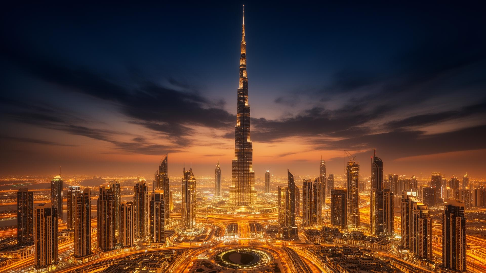

# The Dubai Mall — Digital Experience

A cinematic, high-conversion landing page for **The Dubai Mall**, the world's largest destination for shopping, dining, and entertainment. Built as a premium digital storytelling experience inspired by Apple and luxury fashion brand aesthetics.



---

## ✨ Features

- **Cinematic Hero** — Fullscreen background with animated stats overlay and scroll-triggered CTA
- **Animated Counters** — `requestAnimationFrame`-based count-up for key metrics (111M+ visitors, 1,200+ stores)
- **Scroll Reveal Animations** — `IntersectionObserver`-powered fade-up transitions across all sections
- **Luxury Brand Marquee** — Infinite CSS marquee showcasing flagship retail partners
- **Experience Cards** — Interactive grid featuring Dubai Aquarium, Fountain, Ice Rink, and more
- **Responsive Design** — Fully adaptive layout from mobile to ultrawide
- **SEO Optimized** — Open Graph tags, semantic HTML, single H1, alt text on all images

---

## 🛠 Tech Stack

| Layer       | Technology                        |
|-------------|-----------------------------------|
| Framework   | React 18 + TypeScript             |
| Build Tool  | Vite 5                            |
| Styling     | Tailwind CSS 3 + CSS Variables    |
| UI Library  | shadcn/ui (Radix primitives)      |
| Routing     | React Router DOM 6                |
| Fonts       | Playfair Display + Inter (Google) |
| AI Tools    | Image generation for hero visuals |

---

## 🚀 Getting Started

### Prerequisites

- **Node.js** ≥ 18
- **npm**, **yarn**, **pnpm**, or **bun**

### Installation

```bash
# Clone the repository
git clone <your-repo-url>
cd <project-directory>

# Install dependencies
npm install
```

### Development

```bash
# Start the dev server
npm run dev
```

The app will be available at **http://localhost:8080**.

### Build for Production

```bash
# Create optimized build
npm run build

# Preview the production build locally
npm run preview
```

---

## 📁 Project Structure

```
src/
├── assets/             # AI-generated cinematic images
├── components/
│   ├── ui/             # shadcn/ui primitives
│   ├── Navbar.tsx       # Floating navigation with smooth scroll
│   ├── HeroSection.tsx  # Fullscreen hero with stats overlay
│   ├── StatsSection.tsx # Animated counter cards
│   ├── ExperiencesSection.tsx  # Attraction grid
│   ├── LuxurySection.tsx       # Brand marquee + retail data
│   ├── DiningSection.tsx       # Restaurant showcase
│   ├── EventsSection.tsx       # Global events platform
│   ├── CTASection.tsx          # Leasing & partnership CTA
│   ├── FinalCTA.tsx            # Closing call-to-action
│   └── Footer.tsx              # Site footer
├── hooks/
│   ├── useScrollReveal.ts  # IntersectionObserver scroll animations
│   └── useCountUp.ts       # rAF-based number counter
├── pages/
│   ├── Index.tsx        # Main landing page
│   └── NotFound.tsx     # 404 page
└── index.css            # Design tokens & global styles
```

---

## 🎨 Design System

The project uses a **Noir & Gold** luxury palette defined via CSS custom properties:

| Token           | Value              | Usage                |
|-----------------|--------------------|----------------------|
| `--background`  | Deep black         | Page background      |
| `--foreground`  | Warm white         | Primary text         |
| `--gold`        | Rich gold          | Accent & highlights  |
| `--gold-light`  | Light champagne    | Hover states         |
| `--primary`     | Gold               | Buttons & CTAs       |

Typography: **Playfair Display** (headings) + **Inter** (body).

---

## 🤖 AI Usage

- **Image Generation** — All hero and section backgrounds were generated using AI image tools to create cinematic, on-brand visuals
- **Copywriting** — Luxury-tone marketing copy crafted with AI assistance
- **Code Architecture** — Component structure and animation patterns designed with AI pair-programming

---

## 📄 License

This project was built as part of a technical assessment. All rights reserved.
